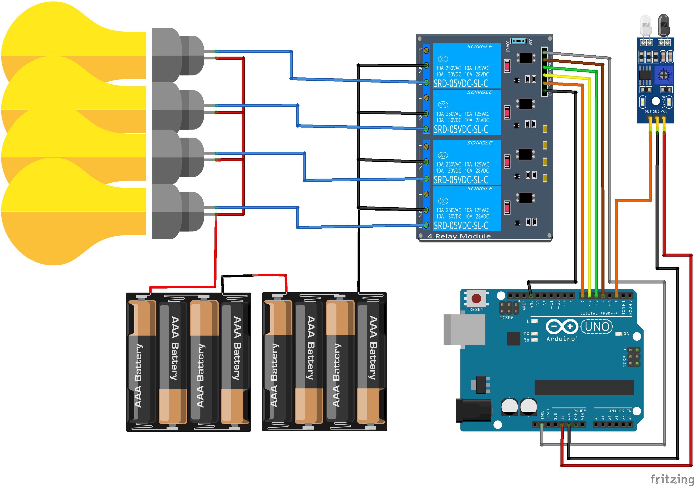

# proiect-sistem-de-iluminare-arduino

## Frameworks

- Involt 1.1.0 - http://involt.github.io/
- NW.js v0.39.2 SDK - https://nwjs.io/
- Moment.js - https://momentjs.com/
- Lodash - https://lodash.com/

## Schematic

